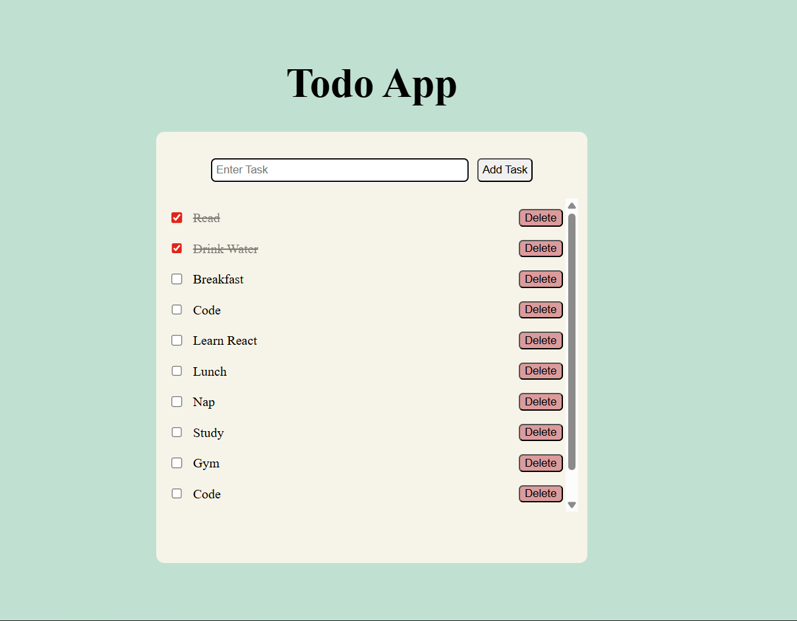

# 📝 Todo App

A simple and interactive Todo App built using **HTML, CSS, and Vanilla JavaScript**.

This project helped me strengthen my understanding of **DOM manipulation, event handling, local storage, and dynamic UI updates in JavaScript**.

## 🚀 Features

- ✅ Add new tasks
- ⌨️ Add task using **Enter key**
- ☑️ Mark tasks as completed
- 🗑️ Delete tasks
- 💾 Persistent storage using **Local Storage**
- 🔄 Tasks remain after page refresh
- 🎨 Clean and responsive UI

## 🛠️ Tech Stack

- **HTML**
- **CSS**
- **JavaScript (Vanilla JS)**

## 📚 Concepts Practiced

- DOM Manipulation
- Event Listeners
- Dynamic Element Creation
- `localStorage`
- Array Methods (`filter`, `find`)
- JSON (`stringify` / `parse`)
- Functions & Code Refactoring
- Conditional Rendering & Styling

## 📸 Preview

## 🔮 Future Improvements

- ✏️ Edit Task Feature
- 🗑️ Delete Selected Tasks
- 🌙 Dark Mode
- 📱 Better Mobile Responsiveness

---

Built as part of my JavaScript learning journey 🚀
